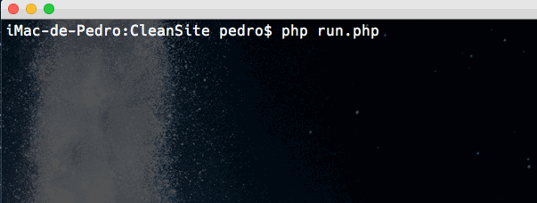

###CleanSite
-----
Remove trechos de códigos maliciosos de um determinado arquivo/pasta.

##Jusitificativa
Quem trabalha com Wordpress e principalmente com plugins de terceiros sabe que frequentemente existe problemas de segurança e que em não é incomum a instalação de seu website ficar comprometida, com todos os arquivos apresentando códigos maliciosos.
Normalmente a solução é reinstalar todo o wordpress e verificar cada plugin para corrigir os problemas de segunraça.
Porém quando existe um grande número de arquivos fora da instalação padrão do wordpress, como temas ou plugins próprios, talvez o processo de reinstalação não seja possível.
Com o CleanSite você consegue de forma fácil e rápida verificar todos os arquivos de sua instalação do wordpress ou qualquer outra pasta contendo arquivos sem grandes problemas.

##Uso
Para utilizar informe o código que deve ser removido no arquivo `bad_code.txt`

Para executar: `php run.php /folder/to/my/files`

Você também pode especificar os tipos de arquivos a serem verificados passando um argumento adicional com a extensão
`php run.php /folder/to/my/files php`

